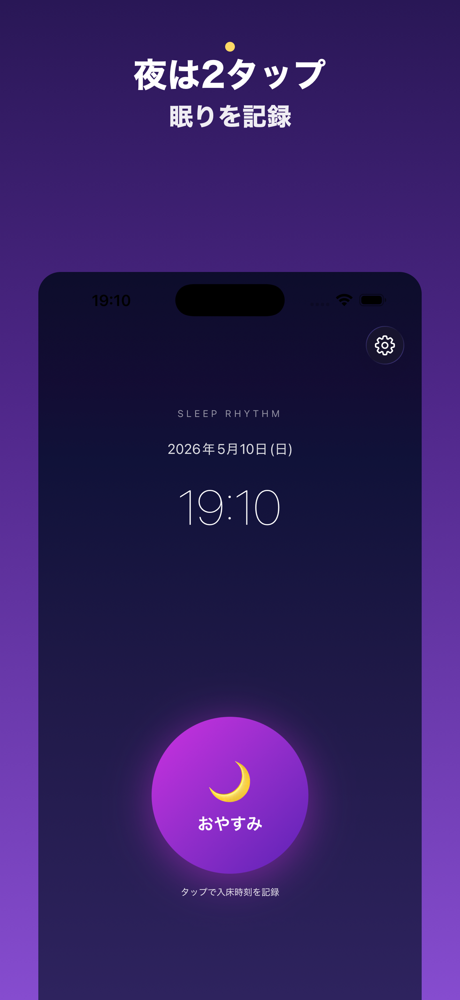
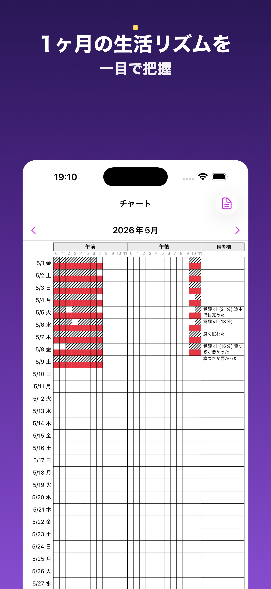
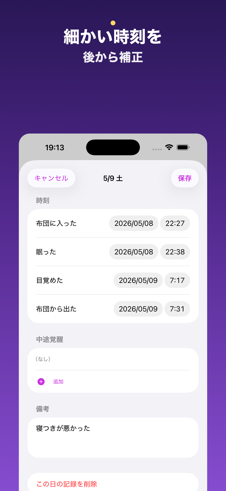
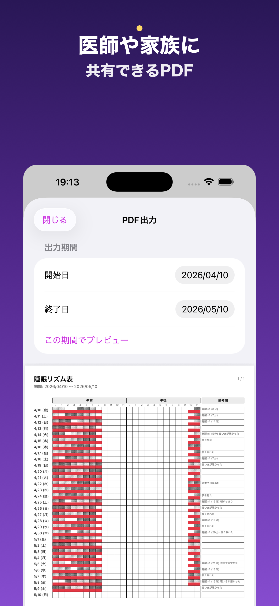
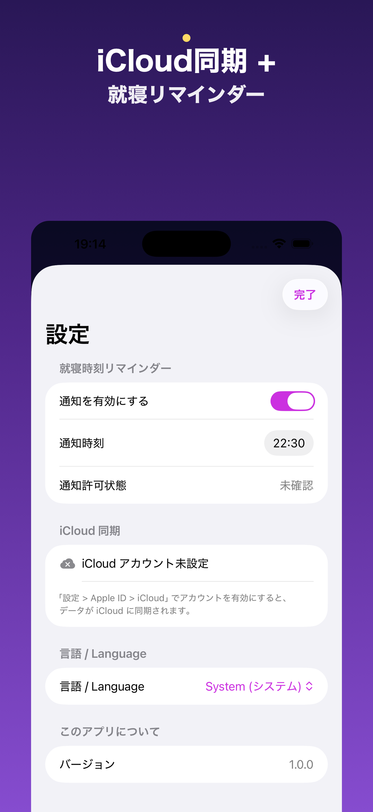

# 睡眠リズム / Sleep Record

[](https://developer.apple.com/ios/)
[](https://swift.org)
[](LICENSE)

2タップで完結する、シンプルな睡眠リズム記録アプリ。
A simple sleep rhythm tracker that captures a full night in two taps.

<p align="center">
  <a href="https://apps.apple.com/us/app/%E7%9D%A1%E7%9C%A0%E3%83%AA%E3%82%BA%E3%83%A0/id6767955166">
    
  </a>
</p>

<p align="center">
  
  
  
  
  
</p>

---

## 日本語

### 概要

寝る前に🌙、起きたら☀️、たったそれだけ。1か月分の睡眠リズムが帯グラフで一目で分かり、PDFとして書き出して医療機関などに共有できます。

### 主な機能

- **2タップUX** — 「おやすみ」と「おはよう」だけで1晩の記録が完了
- **補正シート** — 朝のタップ後に入眠/覚醒時刻を5分単位で微調整
- **中途覚醒の記録** — 夜中に目覚めた時間帯を別途記録可能
- **月別チャート** — 24時間×31日のグリッドで睡眠リズムを可視化
- **PDF出力** — A4縦・35日/ページで医療機関に提出可能な形式
- **iCloud同期** — 機種変更や複数端末でも記録が自動同期(任意)
- **就寝リマインダー** — 指定した時刻にローカル通知でお知らせ
- **完全オフライン** — 広告・アナリティクス・第三者送信は一切なし

### 動作環境

- iOS 26.4 以上
- iPhone 専用(iPadは非対応)
- 開発言語: Swift 5.9 / SwiftUI / SwiftData / CloudKit / PDFKit

### プライバシー

睡眠データは端末内およびユーザー自身のiCloudプライベートデータベースにのみ保存されます。開発者を含む第三者がデータにアクセスする手段は存在しません。詳細は [PRIVACY.md](PRIVACY.md) を参照してください。

---

## English

### Overview

Tap 🌙 before bed, tap ☀️ when you wake up — that's it. View a full month of your sleep rhythm at a glance and export it as a PDF to share with your doctor.

### Features

- **2-tap UX** — A full night is captured with just "Goodnight" and "Good morning"
- **Correction sheet** — Fine-tune fall-asleep / wake-up times in 5-minute increments after the morning tap
- **Mid-sleep awakenings** — Record nighttime wake periods separately
- **Monthly chart** — Visualize sleep patterns on a 24-hour × 31-day grid
- **PDF export** — A4 portrait, 35 days per page, designed for handing to a clinician
- **iCloud sync** — Optional automatic sync across devices via your private CloudKit database
- **Bedtime reminder** — Local notification at a time you choose
- **Fully offline** — No ads, no analytics, no third-party requests, ever

### Requirements

- iOS 26.4+
- iPhone only (iPad not supported)
- Swift 5.9 / SwiftUI / SwiftData / CloudKit / PDFKit

### Privacy

All sleep data lives only on your device and, optionally, your own iCloud private database. Nobody — including the developer — can access it. See [PRIVACY.md](PRIVACY.md) for details.

---

## Build

The Xcode project is generated from `project.yml` via [XcodeGen](https://github.com/yonaskolb/XcodeGen). Regenerate after adding or removing source files:

```bash
xcodegen generate
```

Build for simulator:

```bash
DEVELOPER_DIR=/Applications/Xcode.app/Contents/Developer \
  xcodebuild -project SleepRecord.xcodeproj -scheme SleepRecord \
  -destination 'generic/platform=iOS Simulator' \
  CODE_SIGNING_ALLOWED=NO build
```

Run the tests:

```bash
DEVELOPER_DIR=/Applications/Xcode.app/Contents/Developer \
  xcodebuild -project SleepRecord.xcodeproj -scheme SleepRecord \
  -destination 'platform=iOS Simulator,name=iPhone 17' \
  CODE_SIGNING_ALLOWED=NO test
```

## Architecture

Three layers plus a state machine, no third-party runtime dependencies:

- **Models** — `SleepSession` and `WakeEvent` are the only SwiftData `@Model`s
- **Services** — Pure logic with zero SwiftUI dependencies: `DataStore`, `SleepStateMachine`, `ChartCellCalculator`, `BackfillDetector`, `SleepRecordValidator`, `NotificationScheduler`, `PDFExporter`
- **Views** — Two tabs: `Home` (2-tap UX) and `Chart` (monthly grid + day editor + PDF export). `Settings` is a sheet from Home

See [CLAUDE.md](CLAUDE.md) for the full architectural notes, SwiftData + CloudKit constraints, and common pitfalls.

## License

[MIT](LICENSE) © 2026 ryoshumei

## Contact

- Email: ryoshumei@gmail.com
- Issues: <https://github.com/ryoshumei/SleepRecord/issues>
